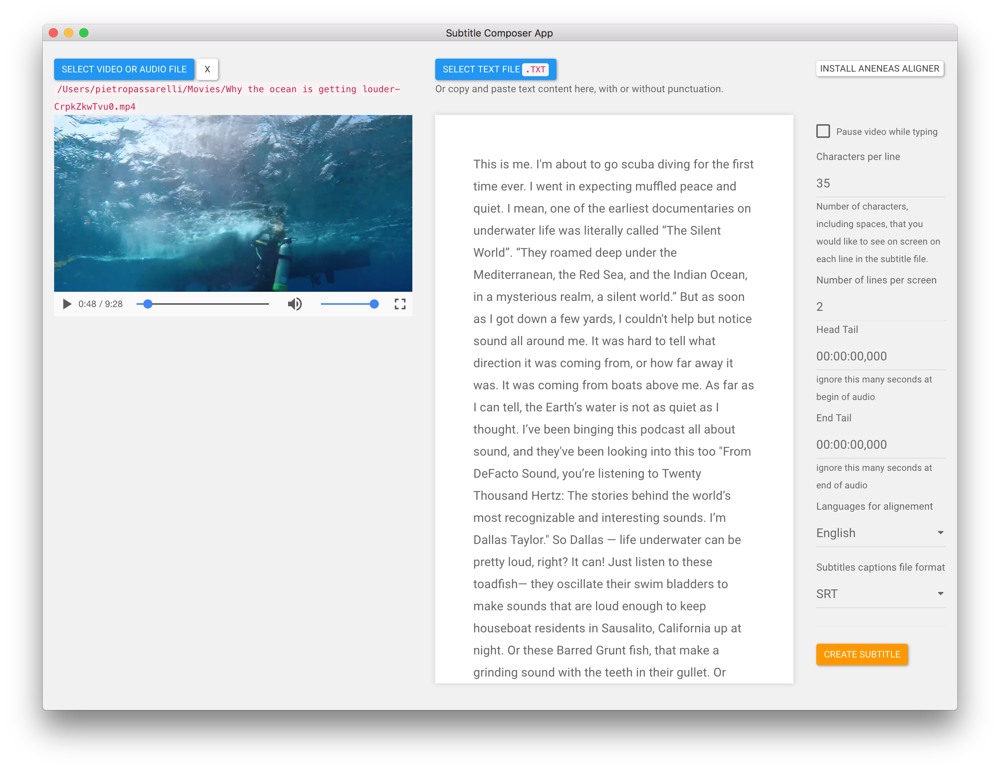

# `subtitleComposer` App

A simple os x desktop app built in electron, using [Aeneas][aeneas] under the hood to generate captions files from media(audio or video) and plain text transcriptions without time-codes.

##  Usage

1. [Go to release section and download, packaged version, ready to use version](https://github.com/pietrop/subtitlesComposer-app/releases). 

2. --> [See user manual for more details](https://www.gitbook.com/book/pietropassarelli/subtitlecomposer-app/) <--

## Dev setup 

git clone, cd into folder, `npm install`, `npm start`.

## Stack 

The app uses electron, bootstrap with bootswatch paper theme, and purpously does not make use of any front end framework to keep things simple a this stage, where the UI/UX and functionality are being defined.

For the alignement it uses the [Aeneas][aeneas] open source project, see user manual for more details on how to get setup with that locally.

### UI to correct captions alignement 
At present the tool does not provide a user interface to correc the alignement of the captions. But for now there are plenty of tools that can be used instead [such as this one](http://www.closedcaptioncreator.com/)

## Todo 

- [X] Char per line option, add to UI.
- [X] Add head and end tail to aeneas comand from UI.
- [ ] escape odd chat in file name, and spaces, for unix (`?`) eg
	- https://www.npmjs.com/package/string-escape
	- or https://www.npmjs.com/package/sanitize-filename

- [ ] Revisit underlying `subtitlescomposer` module to support custom list of `HOMORIFICS`.
	- [ ] provide UI to give / add/edit list.

## Roadmap

TBC

## Issues
Feel free to get in touch if you have any issues, thoughts, questions, or ideas.

## Active Contributors 

- [Pietro](http://twitter.com/pietropassarell)

<!-- Initial requirements gathering and specification while at textAV with Joseph Polizzotto, Gideo, Marshal, and Jane -->

[aeneas]: https://github.com/readbeyond/aeneas